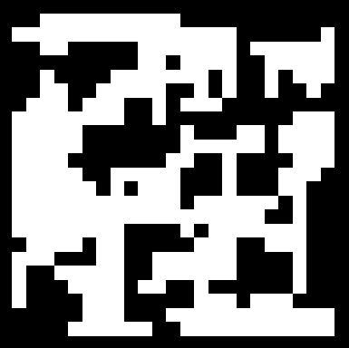

# Procedural Grid Generator 2D for Unity - Running Agents

### Introduction

Recently, I made another attempt at procedural grid generation and I started to play around with new algorithm. If you didn’t read my previous article about Procedural Grid Generation and Cellular Automata algorithm, I encourage you to do so. Today I wish to introduce to you a new approach in grid generation called Running Agents. The base algorithm is quite simple, but I made my own modified version and I wish to describe it step by step to you, I hope it will become useful to you in upcoming projects someday.

### **Running Agents**

Running agents algorithm is actually easy to understand. The agent object is placed on the center of the grid with cells being in filled state. Then we let him move in random directions, for every new position on the grid we mark this cells as empty. During each step we can add or remove agents and they behave the same but independently from each other. New agents can inherit the previous agent position, or in my version the agents are placed in random positions in grid corners. As you can imagine every agent is going in it’s own path, the combination of this path creates a procedurally generated map. Ok we understand the general idea, but now let’s go through the code in detail.

We described grid and cells in previous article but quick reminder: there are two states for a grid cell called filled and empty. Each state holds raw information 0 or 1

```csharp
public enum SquareType {
	EMPTY,
	FILL
}
```

In order to make it more descriptive, we used enum called `SuareType`. We can agree that filled cell can be a wall or blocked area, and empty cell is free space where characters or objects can walk and move. 

```csharp
private void Setup() {
  this.grid = new SquareType[roomWidth, roomHeight];

  for (var i = 0; i < roomWidth; i++) {
    for (var j = 0; j < roomHeight; j++) {
      this.grid[i, j] = SquareType.FILL;
    }
  }
...
```

In `Setup` method we define a grid as 2 dimensional array and we loop through every cell to set as filled state.

```csharp
private void Setup() {
...
	this.agents = new List<Agent>();

  var agent = new Agent();
  agent.position = new Vector2Int(Mathf.FloorToInt(roomWidth / 2), Mathf.FloorToInt(roomHeight / 2));
  agent.direction = GetRandomDirection();
  this.agents.Add(agent);
}
```

In the second part of `Setup` method we define a class variable `agents` as empty list and add first `agent` at the center of our grid.

```csharp
internal class Agent {
  public Vector2Int position;
  public Vector2Int direction;
}
```

To create agents we use class named `Agent` with public `Vector2Int` variables for current `position` on the grid and `direction` vector to move in next step from current `position`.

```csharp
private void Generate() {
  int iteration = 0;

  do {
    foreach (var agent in this.agents) {
      if (this.grid[agent.position.x, agent.position.y] == SquareType.EMPTY) {
        continue;
      }

      this.grid[agent.position.x, agent.position.y] = SquareType.EMPTY;
      this.numberOfEmptySquares++;
    }

    foreach (var agent in this.agents) {
      agent.position += agent.direction;

      agent.position.x = Mathf.Clamp(agent.position.x, 0, roomWidth - 1);
      agent.position.y = Mathf.Clamp(agent.position.y, 0, roomHeight - 1);

      if (Random.value < this.changeDirectionChance) {
        agent.direction = GetRandomDirection();
      }
    }

    for (var i = 0; i < this.agents.Count; i++) {
      if (Random.value > this.removeAgentChance || this.agents.Count <= 1) {
        continue;
      }

      this.agents.RemoveAt(i);
      break;
    }

    for (var i = 0; i < this.agents.Count; i++) {
      if (Random.value > this.addNewAgentChance || this.agents.Count >= this.maxAgents) {
        continue;
      }

      this.agents.Add(CreateAgent());
      break;
    }

    var emptySquaresPercentageValue = (float)this.numberOfEmptySquares / (float)this.grid.Length;

    if (emptySquaresPercentageValue >= emptySquaresPercentage) {
      break;
    }

    iteration++;
  } while (iteration < this.maxIterations);

  if (!addBorder) {
    return;
  }

  for (var i = 0; i < this.roomWidth; i++) {
    for (var j = 0; j < this.roomHeight; j++) {
      if (i == 0 || j == 0 || i == this.roomWidth - 1 || j == this.roomHeight - 1) {
        this.grid[i, j] = SquareType.FILL;
      }
    }
  }
}
```

Inside `do ... while` statement we go through each step until, we reach the `maxIterations` value which is a big number. 

```csharp
private void Generate() {
  int iteration = 0;

  do {
		foreach (var agent in this.agents) {
      if (this.grid[agent.position.x, agent.position.y] == SquareType.EMPTY) {
        continue;
      }

      this.grid[agent.position.x, agent.position.y] = SquareType.EMPTY;
      this.numberOfEmptySquares++;
    }

		...

		iteration++;
  } while (iteration < this.maxIterations);

	...

}
```

At the beginning of the single step we loop through each agent (In first step there will be only one agent). We set the cell in `this.grid` variable at agent’s `position` as `SquareType.EMPTY`. If there is already an empty state set at this grid position, we skip the loop to not increase `this.numberOfEmptySquares` value unnecessarily.

```csharp
private void Generate() {
  int iteration = 0;

  do {

		...

		foreach (var agent in this.agents) {
      agent.position += agent.direction;

      agent.position.x = Mathf.Clamp(agent.position.x, 0, roomWidth - 1);
      agent.position.y = Mathf.Clamp(agent.position.y, 0, roomHeight - 1);

      if (Random.value < this.changeDirectionChance) {
        agent.direction = GetRandomDirection();
      }
    }

		...
		
		iteration++;
  } while (iteration < this.maxIterations);

	...

}
```

In the same single step we proceed to another loop through each agent, but now we change position for all the agents using it’s own`direction` object property. There is a chance to set new random direction for agent, which is determined by `this.changeDirectionChance` value. Method called `GetRandomDirection()` returns the random direction vector and it’s being assigned to `direction` agent object property. During next iteration step the agent will change position using this new direction value.

```csharp
private void Generate() {
  int iteration = 0;

  do {

		...

		for (var i = 0; i < this.agents.Count; i++) {
      if (Random.value > this.removeAgentChance || this.agents.Count <= 1) {
        continue;
      }

      this.agents.RemoveAt(i);
      break;
    }

		...

  } while (iteration < this.maxIterations);

	...

}
```

In this for loop we iterate through the agents another time and check if there is a chance to remove current agent, to do that we use `this.removeAgentChance` value.  After removing the agent we break the loop and proceed with the iteration step.

```csharp
private void Generate() {
      int iteration = 0;

      do {
        
				...

        for (var i = 0; i < this.agents.Count; i++) {
          if (Random.value > this.addNewAgentChance || this.agents.Count >= this.maxAgents) {
            continue;
          }

          this.agents.Add(CreateAgent());
          break;
        }

        var emptySquaresPercentageValue = (float)this.numberOfEmptySquares / (float)this.grid.Length;

        if (emptySquaresPercentageValue >= emptySquaresPercentage) {
          break;
        }

        iteration++;
      } while (iteration < maxIterations);

			...

    }
```

In this next for loop we iterate through the agents another time and check if there is a chance to add new agent, to do that we use `this.addNewAgentChance` value. `CreateAgent()` method is used to create an agent and initializes it’s `position` property. To assign `position` we divide `this.grid` to four equal squares, next we pick one of this four squares and within it’s borders we pick a random position. For next agent we iterate over next squares to avoid repetitions and so on.  After adding the agent we break the loop and proceed with the iteration step. This is the end of single step. This step will be repeated until the `this.maxIterations` is reached.



> *Final result - 25x25 size*
> 

Our final procedurally generated grid looks as above. The map was generated using default parameters (1.3.0 version).

```csharp
private void Generate() {

	...

  if (!addBorder) {
    return;
  }

  for (var i = 0; i < this.roomWidth; i++) {
    for (var j = 0; j < this.roomHeight; j++) {
      if (i == 0 || j == 0 || i == this.roomWidth - 1 || j == this.roomHeight - 1) {
        this.grid[i, j] = SquareType.FILL;
      }
    }
  }
}
```

After the main loop we check if `addBorder` flag is true and perform adding border to the  `this.grid` edge by assigning this cells filled state

### Summary

Similar algorithm was used to procedurally generate levels in Vlambeer’s Nuclear Throne game. Changing parameters can produce different outcome, it’s up to the user to adjust the algorithm for different scenarios:

- Max number of agents
- Agent remove chance
- Agent add chance
- Change direction chance
- Empty squares fill percentage

You can pass custom values to this parameters through `ProceduralGridGeneratorAgents` class constructor or use constructor with default values as I did in this article `1.3.0 package version`. The algorithm is very easy to understand and implement. There is a space for improvement, especially for optimization, because this code is focused on readability. I encourage you to use my package in your own game or try to implement your own version with some additional modifications and improvements if you wish.

Code as unity package is available here → [https://github.com/Paryszek/ProceduralGridGenerator2D](https://github.com/Paryszek/ProceduralGridGenerator2D)

Vlambeer’s Nuclear Throne → [http://nuclearthrone.com/](http://nuclearthrone.com/)